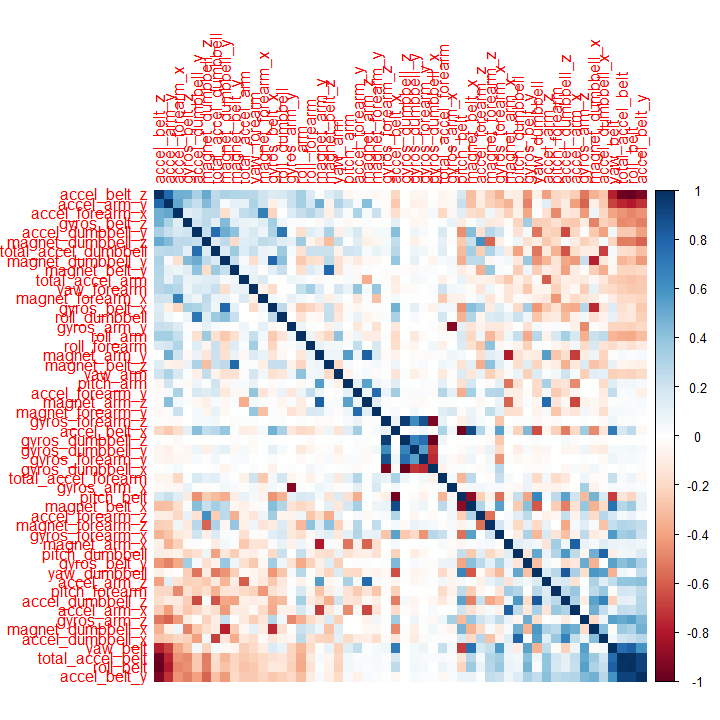
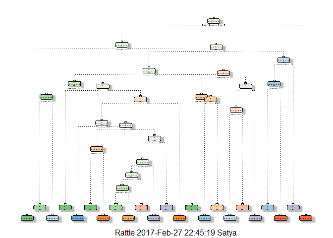

Background
----------

Using devices such as Jawbone Up, Nike FuelBand, and Fitbit it is now
possible to collect a large amount of data about personal activity
relatively inexpensively. These type of devices are part of the
quantified self movement - a group of enthusiasts who take measurements
about themselves regularly to improve their health, to find patterns in
their behavior, or because they are tech geeks. One thing that people
regularly do is quantify how much of a particular activity they do, but
they rarely quantify how well they do it. In this project, your goal
will be to use data from accelerometers on the belt, forearm, arm, and
dumbell of 6 participants. They were asked to perform barbell lifts
correctly and incorrectly in 5 different ways. More information is
available from the [website
here](http://groupware.les.inf.puc-rio.br/har) (see the section on the
Weight Lifting Exercise Dataset).

Summary
-------

The goal of this project is to predict the manner (out of 5 levels: A B
C D E) in which the 6 participants in the study did the exercise in the
test set. This is the "classe" variable in the training set.

Loading Data
------------

    fileUrl <- "https://d396qusza40orc.cloudfront.net/predmachlearn/pml-training.csv"
    download.file(fileUrl, destfile = "train.csv")
    train <- read.csv("train.csv", header = T, na.strings = "NA")

    fileUrl <- "https://d396qusza40orc.cloudfront.net/predmachlearn/pml-testing.csv"
    download.file(fileUrl, destfile = "test.csv")
    test <- read.csv("test.csv", header = T, na.strings = "NA")

Partitioning Training Data
--------------------------

    library(caret)

    ## Warning: package 'caret' was built under R version 3.2.5

    ## Loading required package: lattice

    ## Warning: package 'lattice' was built under R version 3.2.5

    ## Loading required package: ggplot2

    ## Warning: package 'ggplot2' was built under R version 3.2.5

    set.seed(1)
    #partition the train data into %80 Train and %20 Test
    inTrain <- createDataPartition(train$classe,p=0.8, list=FALSE)
    Train <- train[inTrain,]
    Test <- train[-inTrain,]

    dim(Train)

    ## [1] 15699   160

    dim(Test)

    ## [1] 3923  160

There are 160 variables. Not all the variables will be useful to
generate the predictive models. Hence will be apply certain criteria to
chuck the variables that will have little to no value in our analysis.

Cleaning Data
-------------

In this step let's identify and remove unnecessary variables that have
too many NA values.

    Train <- Train[ , !apply(Train, 2 , function(x) any(is.na(x)))]
    Test <- Test[ , !apply(Test, 2 , function(x) any(is.na(x)))]

    dim(Train)

    ## [1] 15699    93

    dim(Test)

    ## [1] 3923   93

Now the number of variables is down to 93. The first 7 variables are
catagorical variables that are not useful in building predictive models
that is based on numerical analysis. So let's discard them as well.

    Train <- Train[, -(1:7)]
    Test  <- Test[, -(1:7)]

    dim(Train)

    ## [1] 15699    86

    dim(Test)

    ## [1] 3923   86

Finally, we will remove variables that have very little to zero variance
in their observations as they will not have good correlation with other
variables.

    z <- nearZeroVar(Train)
    Train <- Train[,-z]
    Test <- Test[,-z]

    dim(Train)

    ## [1] 15699    53

    dim(Test)

    ## [1] 3923   53

The cleaned data set is now more managable with 53 variables that
includes 'classe'.

Correlation
-----------

We can visualize the correlations among all the variables in the
following plot with corrplot function that comes with corrplot package.
Calling all 52 variables that are being analyzed:

    library(corrplot)

    ## Warning: package 'corrplot' was built under R version 3.2.5

    corrplot(cor(Train[,-53]), order = "FPC", method = "color")

We observe that there are quite a few strong correlations as indicated
by dark colored squares (not including the diagonal)

Predictive Models
-----------------

### Random Forest Method

Random Forest method will be used below to build the predictive model
with K set to 5-folds.

    library(randomForest)

    ## Warning: package 'randomForest' was built under R version 3.2.5

    ## randomForest 4.6-12

    ## Type rfNews() to see new features/changes/bug fixes.

    ## 
    ## Attaching package: 'randomForest'

    ## The following object is masked from 'package:ggplot2':
    ## 
    ##     margin

    set.seed(2)
    set <- trainControl(method="cv", number=5, verboseIter=FALSE)
    cvfit <- train(classe ~ ., data=Train, method="rf", trControl=set)
    cvfit

    ## Random Forest 
    ## 
    ## 15699 samples
    ##    52 predictor
    ##     5 classes: 'A', 'B', 'C', 'D', 'E' 
    ## 
    ## No pre-processing
    ## Resampling: Cross-Validated (5 fold) 
    ## Summary of sample sizes: 12559, 12558, 12559, 12561, 12559 
    ## Resampling results across tuning parameters:
    ## 
    ##   mtry  Accuracy   Kappa    
    ##    2    0.9928657  0.9909754
    ##   27    0.9917825  0.9896049
    ##   52    0.9866232  0.9830784
    ## 
    ## Accuracy was used to select the optimal model using  the largest value.
    ## The final value used for the model was mtry = 2.

The accuracy values are high in this model. So we will proceed further
and predict classe variable for the partitioned Test data and check for
accuracy.

    modeltest <- predict(cvfit, Test)
    confusionMatrix(Test$classe, modeltest)

    ## Confusion Matrix and Statistics
    ## 
    ##           Reference
    ## Prediction    A    B    C    D    E
    ##          A 1115    1    0    0    0
    ##          B    4  754    1    0    0
    ##          C    0    5  679    0    0
    ##          D    0    0    9  633    1
    ##          E    0    0    0    1  720
    ## 
    ## Overall Statistics
    ##                                           
    ##                Accuracy : 0.9944          
    ##                  95% CI : (0.9915, 0.9965)
    ##     No Information Rate : 0.2852          
    ##     P-Value [Acc > NIR] : < 2.2e-16       
    ##                                           
    ##                   Kappa : 0.9929          
    ##  Mcnemar's Test P-Value : NA              
    ## 
    ## Statistics by Class:
    ## 
    ##                      Class: A Class: B Class: C Class: D Class: E
    ## Sensitivity            0.9964   0.9921   0.9855   0.9984   0.9986
    ## Specificity            0.9996   0.9984   0.9985   0.9970   0.9997
    ## Pos Pred Value         0.9991   0.9934   0.9927   0.9844   0.9986
    ## Neg Pred Value         0.9986   0.9981   0.9969   0.9997   0.9997
    ## Prevalence             0.2852   0.1937   0.1756   0.1616   0.1838
    ## Detection Rate         0.2842   0.1922   0.1731   0.1614   0.1835
    ## Detection Prevalence   0.2845   0.1935   0.1744   0.1639   0.1838
    ## Balanced Accuracy      0.9980   0.9953   0.9920   0.9977   0.9992

From this model we can see that the predition of classe worked with an
accuracy of %99.44 and a small error rate of %0.56.

### Decision Tree Method

We can also use Decision Tree method to generate a prediction model and
check if it could be a equally good or better model. Let's run the Train
data in this model.

    library(rpart.plot)

    ## Warning: package 'rpart.plot' was built under R version 3.2.5

    ## Loading required package: rpart

    ## Warning: package 'rpart' was built under R version 3.2.5

    library(rattle)

    ## Warning: package 'rattle' was built under R version 3.2.5

    ## Rattle: A free graphical interface for data mining with R.
    ## Version 4.1.0 Copyright (c) 2006-2015 Togaware Pty Ltd.
    ## Type 'rattle()' to shake, rattle, and roll your data.

    set.seed(2)
    dtree <- rpart(classe ~ ., data=Train, method="class")
    fancyRpartPlot(dtree)

    ## Warning: labs do not fit even at cex 0.15, there may be some overplotting

Now using the decision tree variable dtree let's predict the partitioned
Test data.

    preddtree <- predict(dtree, Test, type = "class")
    confusionMatrix(Test$classe, preddtree)

    ## Confusion Matrix and Statistics
    ## 
    ##           Reference
    ## Prediction   A   B   C   D   E
    ##          A 985  38  27  42  24
    ##          B 109 454  78  44  74
    ##          C  15  55 553  46  15
    ##          D  49  50 106 383  55
    ##          E  13  64  83  41 520
    ## 
    ## Overall Statistics
    ##                                           
    ##                Accuracy : 0.738           
    ##                  95% CI : (0.7239, 0.7517)
    ##     No Information Rate : 0.2985          
    ##     P-Value [Acc > NIR] : < 2.2e-16       
    ##                                           
    ##                   Kappa : 0.668           
    ##  Mcnemar's Test P-Value : < 2.2e-16       
    ## 
    ## Statistics by Class:
    ## 
    ##                      Class: A Class: B Class: C Class: D Class: E
    ## Sensitivity            0.8412   0.6868   0.6529  0.68885   0.7558
    ## Specificity            0.9524   0.9065   0.9574  0.92278   0.9379
    ## Pos Pred Value         0.8826   0.5982   0.8085  0.59565   0.7212
    ## Neg Pred Value         0.9337   0.9346   0.9092  0.94726   0.9475
    ## Prevalence             0.2985   0.1685   0.2159  0.14173   0.1754
    ## Detection Rate         0.2511   0.1157   0.1410  0.09763   0.1326
    ## Detection Prevalence   0.2845   0.1935   0.1744  0.16391   0.1838
    ## Balanced Accuracy      0.8968   0.7967   0.8052  0.80581   0.8468

Note that the accuracy is about %73.8 which means there is an error rate
of %26.2. Clearly this is very high error rate than the model generate
by random forest method. At this point it becomes obvious that random
forest did a superior job at building a predictive model due to it's
near %100 accuracy. Hence to conclude we will predict the classe
variable for the original test set of 20 observations with our random
forest predictive model:

    modeltest2 <- predict(cvfit, test)
    modeltest2

    ##  [1] B A B A A E D B A A B C B A E E A B B B
    ## Levels: A B C D E
